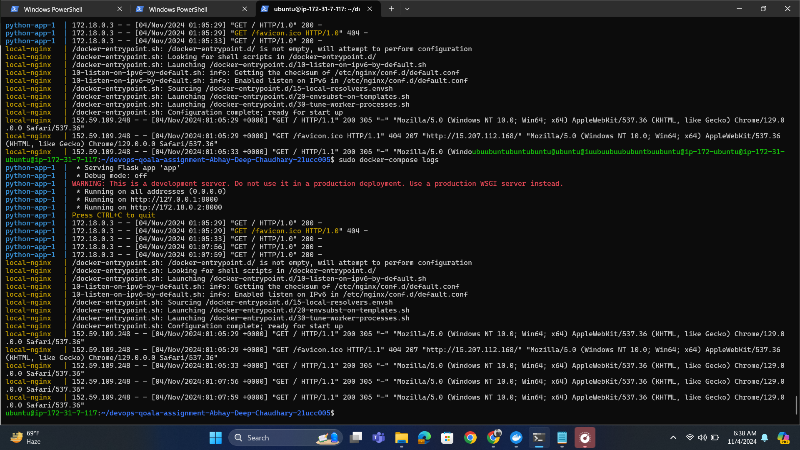

# DevOps Assignment: Debugging and Running a Dockerized Application

Debugged, verified and deployed a Dockerized application as stated in the assignment.

## Solution Overview

The following tasks were completed during the assignment:
1. Set up Docker and Docker Compose.
2. Built Docker images and launched containers.
3. Debugged and resolved intentional errors in the code to ensure the application runs correctly.
4. Verified the application in my browser and checked the logs.
5. Deployed the application on AWS server, verified it and checked the web server logs.

---
## Solution Steps

1. Docker and Docker Compose were already installed and configured on my laptop.
2. Cloned the GitHub assignment repository.
3. Checked the `docker-compose.yaml` for image tags and possible errors.
4. Tried to build images with tags `local-nginx` and `local-python-app` but faced some errors.
5. Resolved the errors and built the images with correct tags and created containers for both the services and successfully verified the application through web browser and took the screenshot of docker-compose logs.
6. Built an EC2 instance on AWS and connected to it remotely through Powershell using ssh command and key associated with the instance.
7. Installed Git, Docker, Docker Compose on the instance and then cloned the debugged and verified version of the application onto the EC2 instance.
8. Again repeated the process of building images and containers on the EC2 instance and edited the security inbound rules to access it on port 80.
9. Verified the deployed the application with the help of public IP address of instance and connected to its port 80 via my browser and finally took the screenshot of docker-compose logs.
10. Finally uploaded everything on this GitHub repository and granted access to `devops@qoala.id`.
11. Added a `Report.pdf` to the github repository.

## Screenshots

1. Application running on EC2 instance with public IP `15.207.112.168`:
    
2. Nginx logs showing successful requests on EC2 instance:
    
3. Application running on localhost:
    
4. Nginx logs showing successful requests on LocalHost:
    

   ## AWS public IP endpoint
    - `http://15.207.112.168`
      

---

